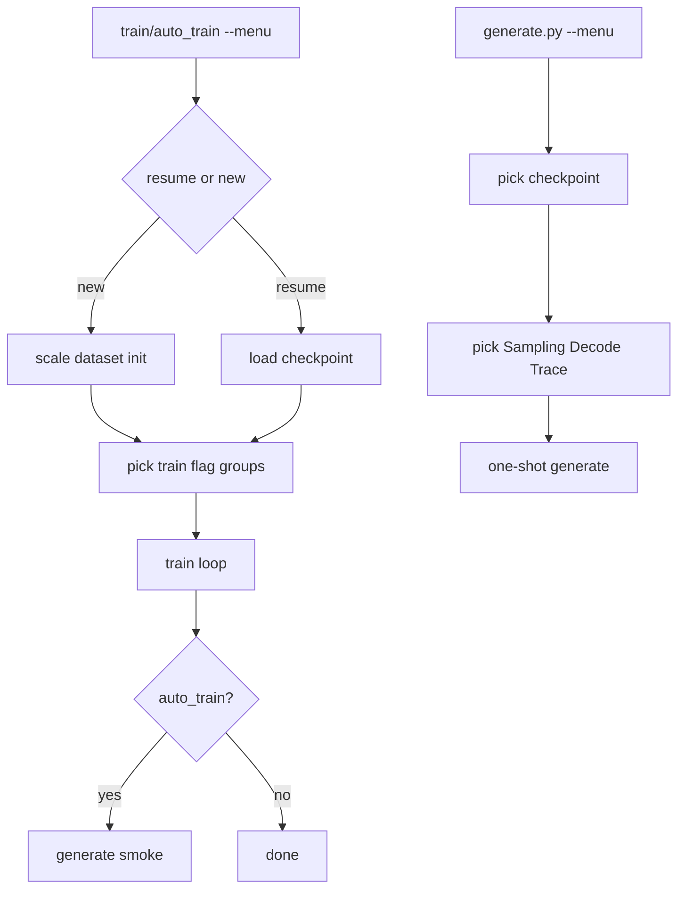

# BPE Default + Full `--menu` Flag Configuration

## Which entry point

| Use | Tool |
|-----|------|
| Long BiggerTest / resume / quarters / `--plot` | [`train.py`](train.py) |
| Train then immediate smoke sample | [`auto_train.py`](auto_train.py) |
| One-shot sample from a checkpoint (KV / cuda-graph / sampling) | [`generate.py`](generate.py) `--menu` |
| Interactive REPL | [`train.py`](train.py) `--generate` or [`interactive.py`](interactive.py) |

Shared `prompt_run_flag_menu` for train / auto_train / generate. Prefer `train.py` for real training; `generate.py --menu` for configuring a sample run without typing every flag.

## Locked decisions

- **Default tokenizer:** `bpe` (merges **200**); char via `--tokenizer char` / menu.
- **Resume:** load vocab type from checkpoint; architecture fixed; still offer **run-flag** groups that apply on resume (length, obs, trace, probe, quality, plot/smoke).
- **Parity / benches:** stay on tiny char fixtures.
- **Explicit CLI always wins** over menu answers; `--no-prompt` skips all interactive asks.

---

## Flag inventory (source of truth: [`py_calls.md`](py_calls.md) + [`guide.md`](guide.md))

Menu configures these **groups**. Meta / alternate-mode flags are excluded from the picker.

### Always relevant (new + shared)

| Group | Flags | Recipe defaults (Enter) |
|-------|-------|-------------------------|
| **Tokenizer** (new) | `--tokenizer`, `--bpe-merges` | `bpe`, `200` |
| **Length** | `--learning-rate`, `--epochs` / `--steps`, `--log-every`, `--checkpoint-every`, `--min-lr-ratio`, `--window-stride`, `--val-every` | preset/config values; guide recipe: LR `3e-4`, stride `64`, val-every `0`, min-lr-ratio `0.1` |
| **Model** (fresh runs only) | dims, `--batch-size`, wd, warmup, clip, `--grad-accum`, tie embeddings, `--run-budget`, `--norm-type`, `--pos-encoding`, `--grad-checkpoint` | rmsnorm / rope / tied / grad-checkpoint **off** |
| **Obs** | `--runtime-metrics`, `--memory-timeline` | both **off** (guide: leave off for max tok/s) |
| **Trace** | `--verbose`, `--trace-*`, `--trace-every` | all **off**; trace-every = train 10% rule when first enabled |
| **Probe** | `--no-generate-probe`, `--generate-probe-prompt`, `--generate-probe-tokens`, temp/top-k/top-p (train probe path) | probes **on**; prompt `once upon a`; tokens `256` |
| **Quality** | `--quality-trial` / `--no-quality-trial`, `--quality-prompt`, `--quality-weights` | trial **on** in interactive menu (matches today's `should_run_quality_trial`); off under `--no-prompt` |

### Entry-point extras

| Group | Where | Flags | Default |
|-------|-------|-------|---------|
| **Plot** | `train.py` only | `--plot` | **off** |
| **Smoke generate** | `auto_train.py` only | `--prompt`, `--max-new-tokens`, `--temperature`, `--top-k`, `--top-p` | `the` / `80` / probe defaults |
| **Sampling** | `generate.py` `--menu` | `--prompt`, `--max-new-tokens`, `--temperature`, `--top-k`, `--top-p`, `--seed` | `the` / `80` / `0.8` / no top-k / no top-p / `42` |
| **Decode** | `generate.py` `--menu` | `--no-kv-cache`, `--cuda-graph` | KV cache **on** (`--no-kv-cache` off); cuda-graph **off** |
| **Trace** | `generate.py` `--menu` (same shared group) | `--verbose`, `--trace-*`, `--trace-every` | all **off**; every-step when enabled |

### Excluded from menus (meta / other entry modes)

`--menu`, `--no-prompt`, `--config` (wizard writes config), `train --generate` / `--compare-quarters` / `--set-best` (alternate modes), `--resume` (train Step 0), `--data-dir` / `--models-dir` as free-form path typing (checkpoint still picked via interactive scanner).

---

## Menu UX (locked)

Shared helper in [`cli_common.py`](cli_common.py): `prompt_run_flag_menu(args, *, fresh_run: bool, entry: "train"|"auto_train"|"generate")`.

### train / auto_train

1. **After** Step 0 (resume/new) and (if new) existing scale/dataset/init wizard in [`setup/training_setup.py`](setup/training_setup.py).
2. Print group checklist (train/auto_train groups as below); Enter = keep defaults for unlisted groups.
3. Per selected group: prompt every flag (`y/N` / `Y/n` for booleans; value with `[default=…]`).
4. Fold existing `prompt_model_hyperparams` / length prompts into **Model** / **Length** (no double-ask).
5. Stop char `vocab_size = len(set(...))` in `_setup_dataset`; set after tokenizer build.

```text
Configure run flags — groups to customize (Enter=none / e.g. 1,4,7 or all)
  [1] Tokenizer … [7] Quality … [8] Plot|Smoke …
```

### generate.py `--menu` (new)

Add `--menu` and `--models-dir` (default `output/checkpoints`) to [`generate.py`](generate.py).

1. If `--checkpoint` was not an explicit override from a prior pick: interactive checkpoint picker (reuse `cli_common.select_checkpoint_interactive` / same scanner as `train --generate`).
2. Flag-group picker (generate-only set):

```text
Configure generate flags — groups to customize (Enter=none)
  [1] Sampling     default: prompt=the, tokens=80, temp=0.8, no top-k/p
  [2] Decode       default: KV cache on, cuda-graph off
  [3] Tracing      default: all off
  Groups to customize [Enter=none / e.g. 1,2 or all]:
```

3. Run one-shot `generate(args)` with the resulting flags (not the interactive REPL — that stays `train --generate` / `interactive.py`).



---

## Tokenizer / checkpoint work (unchanged core)

- Factory: `build_tokenizer` / `load_tokenizer` / aligned `save_vocab` + `id_to_token(id)` on BPE.
- Wire [`train.py`](train.py) `build_tokenizer_and_config`, [`training/checkpoint.py`](training/checkpoint.py).
- CLI: `--tokenizer {bpe,char}` default `bpe`; `--bpe-merges` default `200`.

---

## Docs

- [`py_calls.md`](py_calls.md): menu group pickers for `train` / `auto_train` / `generate`; tokenizer flags; defaults on/off.
- [`guide.md`](guide.md): train `--menu` for runs; `generate.py --menu` for sampling/KV/cuda-graph; BPE default for new training.
- README: BPE default; demote “char remains BiggerTest default”.

## Out of scope

- Converting old char checkpoints to BPE
- Changing parity baselines to BPE
- Merging `generate.py --menu` into the interactive REPL (`interactive.py` stays separate)
- Stage 4 follow-ons (full-decode graph, device top-p)
