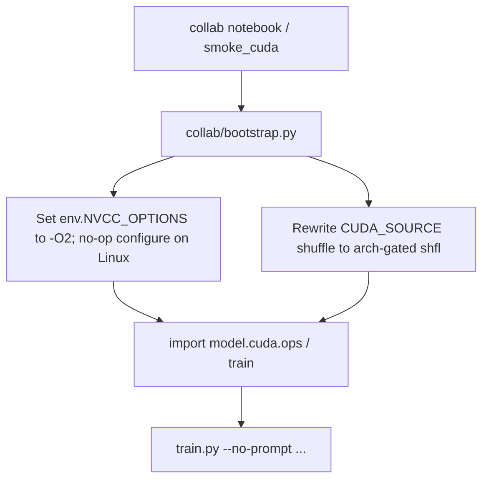

# Collab-only T4 package (branch `collab`)

## Hard constraint (non-negotiable)

**ONLY create/edit files under [`collab/`](collab/).**

- Do **not** modify [`model/cuda/env.py`](model/cuda/env.py), [`kernels.py`](model/cuda/kernels.py), [`ops.py`](model/cuda/ops.py), [`train.py`](train.py), [`cli_common.py`](cli_common.py), or any other non-`collab/` path.
- Git branch name: **`collab`**.
- Commits on that branch add/change **`collab/**` only**.

Core Windows GT 730 code on `main` stays untouched. Colab compatibility is injected at **runtime** from `collab/`.

## Why core still works on Colab without editing it

Windows `env.py` / Kepler `__shfl_down` break Linux T4 **at import**. Fix inside `collab/` by patching **before** `model.cuda.ops` loads:



## Layout (everything under `collab/`)

```text
collab/
  README.md
  requirements.txt
  bootstrap.py              # MUST run before any training/CUDA import
  smoke_cuda.py
  make_toy_config.py
  sync_drive.py
  run_train.py              # thin wrapper: bootstrap then subprocess/train import
  configs/collab_toy.json
  llm_gpu8_t4.ipynb
```

| File | Role |
|------|------|
| [`collab/bootstrap.py`](collab/bootstrap.py) | Repo-root on `sys.path`; Linux: clear Windows `NVCC_OPTIONS`, no-op `configure`; patch `kernels.CUDA_SOURCE` warp reduce to `#if __CUDA_ARCH__ >= 700` / `__shfl_down_sync`; never import `ops` until patches applied |
| [`collab/smoke_cuda.py`](collab/smoke_cuda.py) | Calls bootstrap, then device info + vector-add / ops import smoke |
| [`collab/run_train.py`](collab/run_train.py) | Bootstrap then `subprocess` `python train.py ...` with `--no-prompt --no-quality-trial` (avoids hanging `input()` without editing CLI) |
| [`collab/make_toy_config.py`](collab/make_toy_config.py) | Copy/ensure toy config |
| [`collab/sync_drive.py`](collab/sync_drive.py) | `--push` / `--pull` ↔ Drive |
| [`collab/configs/collab_toy.json`](collab/configs/collab_toy.json) | Non-interactive toy config |
| [`collab/llm_gpu8_t4.ipynb`](collab/llm_gpu8_t4.ipynb) | Full T4 runbook |
| [`collab/README.md`](collab/README.md) | Share + **exact pull commands** + test checklist |

## Branch + Colab pull (locked)

1. Locally: `git checkout -b collab` (from current `main`), add only `collab/`, commit.
2. Push when ready: `git push -u origin collab`
3. In Colab (T4 runtime), clone/fetch that branch — **whole repo** is required (core code lives outside `collab/`), but the **only new code** on the branch is under `collab/`:

```bash
# Colab cell — pull branch `collab` and enter repo root
!git clone -b collab --single-branch https://github.com/dtelcore/llm-gpu-8.git /content/llm-gpu-8
%cd /content/llm-gpu-8
!pip install -q -r collab/requirements.txt
!python collab/smoke_cuda.py
```

If the repo already exists on Drive:

```bash
%cd "/content/drive/MyDrive/llm gpu 8"   # or your path
!git fetch origin collab
!git checkout collab
!pip install -q -r collab/requirements.txt
!python collab/smoke_cuda.py
```

Train via wrapper (bootstrap first):

```bash
!python collab/run_train.py --config collab/configs/collab_toy.json \
  --checkpoint output/checkpoints/collab_smoke --epochs 2 --seed 0
```

## Notebook cells (all invoke `collab/` only for new logic)

0. `nvidia-smi`  
1. Clone/checkout `collab` as above; `%cd` repo root  
2. `pip install -r collab/requirements.txt`  
3. `python collab/smoke_cuda.py`  
4. `python collab/make_toy_config.py`  
5. `python collab/run_train.py ...`  
6. `python generate.py ...` (stock CLI; flags only — no core edits)  
7. Short steps + quarters via `run_train.py`  
8. `python collab/sync_drive.py --push`  
9. Resume with `run_train.py --resume ...`

## Explicitly cancelled / out of scope for this branch

- Editing [`model/cuda/*`](model/cuda/), [`train.py`](train.py), [`auto_train.py`](auto_train.py), [`cli_common.py`](cli_common.py)
- Root-level `requirements-colab.txt`
- Permanent in-tree Linux `env.py` port (can be a later `main` PR if desired)

## Implementation order

1. Create branch `collab`
2. Write full `collab/` tree (bootstrap + helpers + config + notebook + README with pull commands)
3. Commit **only** `collab/`
4. Document push + Colab clone/checkout cells in README (user runs push if not done in-session)
