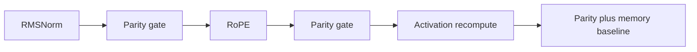

# Architectural Modernization: RMSNorm → RoPE → Recompute

Foundational loop work (grad accum, `run_budget_steps`, Adam resume warning, tied embeddings) stays as-is. This plan upgrades the GPT-2-era block in three gated milestones on the existing PyCUDA/Kepler stack.

**Compatibility default:** each feature is a config flag; legacy checkpoints (no flag / BiggerTest) keep LayerNorm + learned positions + full activation cache. New presets (`toy`, `tiny_stories`, …) turn the new defaults on as each milestone ships.

---

## Milestone 1 — RMSNorm (simplest kernel swap)

**Goal:** replace mean/var LayerNorm with RMSNorm (scale-only, no β) while preserving residual fusion call shape.

**Kernel / ops** ([`model/cuda/kernels.py`](model/cuda/kernels.py), [`model/cuda/ops.py`](model/cuda/ops.py)):
- Add `rmsnorm_fp32`, `rmsnorm_cache_fp32`, `residual_rmsnorm_cache_fp32`, `rmsnorm_backward_fp32` (RMS = √(mean(x²)+ε); `x̂ = x · inv_rms`; VJP without mean-centering).
- Keep existing LN kernels for legacy; dispatch from ops by `norm_type`.

**Model wiring** ([`model/gpt.py`](model/gpt.py), [`model/weights.py`](model/weights.py), [`model/config.py`](model/config.py)):
- `GPTConfig.norm_type`: `"layernorm"` | `"rmsnorm"` (default `"layernorm"` for load safety).
- When `rmsnorm`: allocate only `ln*_gamma` / `final_ln_gamma`; omit betas from trainable set (and from Adam).
- Host twins `_layernorm_cache` / `_layernorm_backward` get RMSNorm counterparts for NumPy parity path.
- Residual fuse sites (post-attn → LN2, post-MLP → next LN1 / final) call residual RMSNorm; layer-0 LN1 stays standalone.

**Setup / VRAM** ([`setup/model_config.py`](setup/model_config.py)): subtract `β` params from footprint when RMSNorm; presets set `norm_type: "rmsnorm"` after milestone lands.

**Verification:**
- Extend [`tests/parity/test_layernorm.py`](tests/parity/test_layernorm.py) for RMSNorm fwd+bwd.
- Add residual-fuse RMSNorm parity (gap today even for LN).
- Full [`tests/parity/test_step.py`](tests/parity/test_step.py) with `norm_type=rmsnorm`.

---

## Milestone 2 — RoPE (replace absolute positions)

**Goal:** drop `position_embedding[max_len, C]`; apply rotary embeddings to Q/K per head after QKV projection.

**Config / weights:**
- `GPTConfig.pos_encoding`: `"learned"` | `"rope"` (default `"learned"` for legacy).
- When `rope`: do not allocate `position_embedding`; remove from Adam / param count / VRAM estimate.
- Keep `max_len` as context window + RoPE cache length (still required for dataset windows and decode caps).

**Kernels** ([`model/cuda/kernels.py`](model/cuda/kernels.py) / [`ops.py`](model/cuda/ops.py)):
- `rope_apply_fp32` on Q and K in heads layout `[B·H, T, hd]` (rotate pairs; θ_i = base^(-2i/hd), base=10000).
- `rope_backward_fp32` (adjoint is rotate by −θ).
- Prefetch or build cos/sin table once per `(max_len, hd)` on device; reuse across layers/steps.

**Forward / backward / generate** ([`model/gpt.py`](model/gpt.py)):
- GPU train: after `linear_qkv_split` / heads pack, apply RoPE to Q/K before `causal_self_attention`; store angles or positions in attn cache for backward.
- Host reference path mirrors the same math for parity.
- Embed path: token lookup only (no `pos_emb[t]` add) when RoPE.
- KV decode (`_decode_kv`): apply RoPE at absolute position `pos = T_past` on the new token’s Q/K; past K already rotated at write time (cache rotated K/V — standard decode pattern).

**Verification:**
- New `tests/parity/test_rope.py` (apply + backward vs NumPy).
- Step parity with `pos_encoding=rope`.
- KV determinism / greedy match updates in [`tests/parity/test_kv_cache.py`](tests/parity/test_kv_cache.py).

---

## Milestone 3 — Selective activation recomputation

**Goal:** cut the ~99 MB forward activation cache (BiggerTest shapes) without FlashAttention (unavailable on sm_35).

**Policy (fixed, not optional mid-design):** opt-in `gradient_checkpointing: true` / `--grad-checkpoint`. Per layer, **keep** `ln1_out_d` / `ln2_out_d` (and LN stats needed for LN/RMSNorm bwd); **drop** attention intermediates (`probs_d`, `q_d`/`k_d`/`v_d`, `attn_concat_d`) and MLP (`hidden_d`, `act_d`). Recompute them in reverse order during `backward_batch_gpu` using existing kernels (`linear_qkv_split` + `causal_self_attention` + `matmul_bias_gelu`).

**Why this cut:** `probs_d` alone is ~32 MB across 4 layers at T=256; MLP `hidden`+`act` ~32 MB more. Residual stream is not stored as a separate tensor today—do not invent full-block checkpointing in v1.

**Implementation sketch** ([`model/gpt.py`](model/gpt.py)):
- Forward: if checkpointing, omit large keys from `layer_cache` / `attn` / `mlp`.
- Backward: before attn bwd, recompute Q/K/V (+ RoPE if enabled) and probs from `ln1_out_d`; before MLP bwd, re-run expand+GELU from `ln2_out_d`.
- Interact cleanly with Stage 3.5 FP16 storage (nothing to compress if keys never stored).

**Measurement:**
- Re-run activation account ([`tools/tracing/activation_account.py`](tools/tracing/activation_account.py) / stage34-style) and freeze a new baseline under `output/baselines/`.
- Expect ~60–80 MB less resident activation cache at BiggerTest shapes; accept higher step time (attention recompute dominates on GT 730).

**Verification:**
- Step parity with checkpointing on vs off (same weights, grads within existing rtol/atol).
- Short train smoke: `--grad-checkpoint --grad-accum 4` does not OOM and loss stays finite.

---

## Cross-cutting discipline (every milestone)

1. **Parity before merge** — `python -m tests.parity.run_parity` green.
2. **Config in `config.json`** — flags round-trip through checkpoint save/load; old runs unchanged.
3. **Docs** — brief README / `py_calls.md` flag notes only after each milestone ships.
4. **Do not** chase bf16/AMP or CUDA Graphs here (still Not yet / Kepler-limited).

---

## Suggested execution order when implementing

| Phase | Deliverable | Approx. touch surface |
|-------|-------------|------------------------|
| M1 | RMSNorm + parity | kernels, ops, gpt, weights, config, presets, test_layernorm |
| M2 | RoPE + KV + parity | kernels, ops, gpt embed/attn/decode, weights, test_rope, test_kv |
| M3 | Grad checkpoint + memory baseline | gpt forward/backward cache policy, CLI, activation baseline |

No code changes until you approve this plan and ask to implement (recommend starting with **M1 only** in the first implementation pass).
