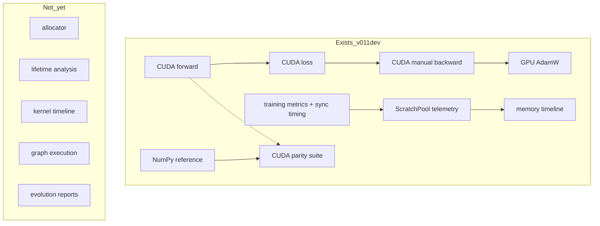

# Observability + Verification Foundation (Stage 3.1 exit / v0.1.1-dev)

## Goal

Finish Stage 3.1 as the **scientific control**: measurement/correctness shipped; cache contract fixed; remaining exit work is **freeze the empirical baseline** and **document exists-vs-toward + telemetry conclusions**.

Principle:

```text
Measurement → Understanding → Optimization
```

Empirical answer from the first BiggerTest metrics window:

> Is the GT 730 limited by transfers or by the transformer workload?
> **Not transfers.** Next chapter = memory efficiency and model efficiency, not CUDA plumbing.

Live train path (unchanged):

```text
GPU forward → GPU loss → GPU manual backward → GPU AdamW
```

```text
NumPy path = reference / fallback / parity
```

---

## Honest architecture (exists vs toward)

```text
llm-gpu-8 v0.1.1-dev

Runtime
 ├── CUDA forward
 ├── CUDA loss
 ├── CUDA manual backward
 ├── GPU AdamW
 └── ScratchPool telemetry

Observability
 ├── training metrics
 ├── sync timing
 └── memory timeline

Verification
 ├── NumPy reference path
 └── CUDA parity suite

Not yet:
 ├── allocator
 ├── lifetime analysis
 ├── kernel timeline
 ├── graph execution
 └── model evolution reports
```



**Adam moments:** still allocated FP32 `m`/`v`. Do not drop in 3.1; baseline makes cost visible.

---

## First telemetry window (scientific control source)

Source: BiggerTest256256 train with `--runtime-metrics` / memory timeline, step **111100/111200** (2026-07-22).

```text
Model:
  vocab        110
  params       ~3,281,518
  layers       4
  heads        8
  context      256

GPU:
  GT 730 GK208
  CC 3.5

Runtime (this window):
  586 tok/s
  1747.9 ms/step
  device_used_mb = 844
  vram_free_mb   = 3252
  scratch_peak   = 28.1 MB
  sync_count     = 200
  sync_ms        = 64.70
  grad_norm      = 3.2682
  param_norm     = 112.4734
  loss           = 0.9305
  ppl            = 2.5359
  lr             = 1e-5
```

Learning curve vs older README snapshot (step 101k: train ~0.97 / val ~0.96 / quality ~0.884): late fine-tune at `1e-5` is still moving. Remaining ~100 steps to 111200 are a checkpoint boundary, not a meaningful training phase.

### Memory implication

ScratchPool is **not** the dominant VRAM consumer:

```text
844 MB device usage (approx)

├── parameters          ~13 MB FP32
├── Adam m/v            ~26 MB × 2 FP32
├── activations         largest component
├── CUDA workspace      ~28 MB ScratchPool
└── PyCUDA / driver
```

Future memory work must **not** start with ScratchPool redesign. Likely big wins: activation retention, attention buffers, precision reduction. Timeline plot (`memory_timeline_BiggerTest256256.jsonl`) expected to show pool plateau ~28 MB → conclusion: reuse works; activation lifetime is next.

### Sync implication

```text
64.70 ms / 200 steps ≈ 0.32 ms sync/step
0.32 / 1747.9 ≈ 0.018% of step time
```

PCIe synchronization is **not** the bottleneck. V2 GPU-resident weights already removed the expensive host/device path. Next speed gains = compute or memory bandwidth, not sync elimination.

### Gradient signal

`grad_norm / param_norm ≈ 0.029` looks stable. Future diagnostics graph: step → loss, grad_norm, param_norm, ratio. Sudden `grad_norm ↑↑` with `loss ↑` flags instability. (Plotter enhancement later — not a 3.1 exit blocker.)

---

## Shipped work (complete)

Runtime metrics (off by default), ScratchPool → MemoryTimeline, extended `[train]` fields, timeline CLI, `tests/parity/`, README five pillars + `0.1.1-dev`, **batch cache contract** (`forward()` may squeeze logits; cache keeps `B`/`T` for backward).

---

## Stage 3.1 exit — remaining work

### 1. Freeze baseline artifact

Write [`output/baselines/stage31_baseline.json`](output/baselines/stage31_baseline.json) from the telemetry window above (not null placeholders):

```json
{
  "version": "0.1.1-dev",
  "captured_at": "2026-07-22",
  "source": {
    "checkpoint": "output/checkpoints/BiggerTest256256",
    "step": 111100,
    "log_window": "sync_count=200 metrics-enabled train window"
  },
  "hardware": {
    "gpu": "GT 730 GK208",
    "compute_capability": "3.5"
  },
  "model": {
    "vocab_size": 110,
    "params": 3281518,
    "embedding_dim": 256,
    "layers": 4,
    "heads": 8,
    "context": 256
  },
  "runtime": {
    "tokens_per_sec": 586,
    "step_ms": 1747.9,
    "sync_count": 200,
    "sync_ms": 64.70,
    "scratch_peak_mb": 28.1,
    "grad_norm": 3.2682,
    "param_norm": 112.4734
  },
  "memory": {
    "device_used_mb": 844,
    "vram_free_mb": 3252,
    "parameter_mb_est": 12.5,
    "adam_estimated_mb": 50.0,
    "activation_estimated_mb": "remainder_dominant",
    "scratch_peak_mb": 28.1,
    "note": "ScratchPool is not the dominant consumer; activations are."
  },
  "quality": {
    "train_loss": 0.9305,
    "train_ppl": 2.5359,
    "val_loss_prior_readme_101k": 0.96,
    "quality_score_prior_readme_101k": 0.884
  },
  "conclusions": [
    "PCIe sync is not the bottleneck (~0.018% of step_ms)",
    "ScratchPool redesign is not priority (peak ~28 MB)",
    "Next chapter: memory efficiency + model efficiency"
  ]
}
```

Rough Adam/param MB estimates are fine. Optional: run timeline `--plot` and note plateau in README.

### 2. README honesty + conclusions pass

Update [`README.md`](README.md):

- Exists vs Not yet tree
- Notable run / Stage 3.1 baseline pointer to `stage31_baseline.json`
- Explicit demotions: more weight-sync work; ScratchPool redesign
- Stage 3.1 exit = measurable + verified + baselined, not optimized
- Refresh step/loss notes (111k train loss ~0.93) without changing BiggerTest hyperparameters

---

## Out of scope for Stage 3.1 exit (hard)

- Arena allocator / activation recompute / FP16 storage / streaming attention
- BPE, KV cache implementation, computation graph, O4 evolution HTML report
- Dropping Adam `m`/`v`
- Creating dead stub modules
- Changing BiggerTest training hyperparameters
- New fused / “possible” CUDA kernels
- **Further weight-sync optimization** (evidence: sync ≪ step time)
- **ScratchPool redesign** (evidence: peak ~28 MB vs ~844 MB device)

---

## Acceptance criteria (Stage 3.1 exit)

1. Prior criteria hold: metrics flags, timeline CLI, parity, five pillars, cache contract
2. `output/baselines/stage31_baseline.json` filled from the 111100 telemetry window
3. README shows exists vs Not yet + baseline conclusions (not transfer-bound; activations dominate)
4. Metrics disabled: no material regression vs frozen runtime numbers

---

## After exit — roadmap (evidence-ranked)

```text
3.1 Metrics + parity + baseline freeze     ← exit remaining
 |
3.2 KV cache                               ← first feature (no train-path risk)
 |
3.3 BPE experiments                        ← semantic window vs embed/LM cost
 |
3.4 Activation memory accounting           ← attribute VRAM before optimizing
 |
3.5 FP16 storage
 |
3.6 Lifetime allocator
 |
3.7 Kernel timeline / execution graph
 |
3.8 Evolution reports
```

### Not priority (telemetry-backed)

- More weight synchronization optimization — sync ~0.32 ms/step
- ScratchPool redesign — peak ~28 MB

### High-value next targets

1. **Baseline artifact** — this exit
2. **KV cache** — generation latency ↓; no training risk
3. **BPE** — 3.28M params / 110 vocab / 256 char context spends capacity on character composition; BPE likely larger semantic window (measure with protocol table, do not claim win a priori)
4. **Activation accounting** — before FP16/allocator, attribute:

```text
VRAM: weights | optimizer | attention | MLP cache | LN cache
```

Then optimize the largest bucket.

### Stage 3.2 — KV cache (next plan)

Does not touch training kernels, checkpoints, optimizer, tokenizer, or parity. Generation only: cache prompt K/V; append per new token. Measure generate latency/tokens/sec.

### Stage 3.3 — BPE evaluation protocol

Char vs BPE on same hardware: context coverage, training speed, VRAM, val loss, coherence, vocab size. Tradeoff: attention cheaper per semantic span; embedding/LM head larger.

### Later

3.4 accounts activations → 3.5 FP16 → 3.6 allocator/lifetime → 3.7 graph/kernel timeline → 3.8 evolution reports. Each change: (1) runtime better? (2) correctness held?
