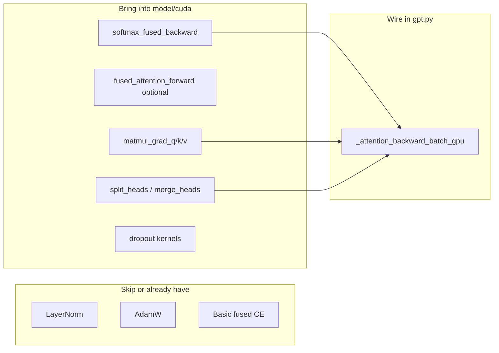

# Port High-Value Kernels from llm gpu 5/core

## Phase 1 status (2026-07-14)

**Done.** `_attention_backward_batch_gpu` now uses:
- `interleaved_to_heads` / `merge_heads` / `pack_qkv`
- `softmax_fused_backward` (one launch over `H=B*NH`)
- `gemm_batched_fp32` with transpose flags (4 launches) — **not** the naive `matmul_grad_*` element loops (those were ~3× slower on Kepler)

Also fixed `matmul(..., x.T)` which previously ignored strides and produced **wrong** results (affected old attn bwd + `linear_backward`).

Golden-check vs NumPy: pass at T=32 and T=256. bigwide batch=4 ≈25s/step (flat vs ~24s baseline; gradients now correct).

## Phase 1b / Phase 2 status (2026-07-14 evening)

**Done (adapted for Kepler):**
- GPU `reduce_sum_axis0` for bias grads (no `to_host().sum`)
- `gemm_bias_fp32` fused forward linear
- `causal_mha_fp32` race fix (extra `__syncthreads` after warp reduce) — matches NumPy
- `matmul(.T)` materializes contiguous transpose (strided gemm was TDR-slow)
- Head-layout cache for attn bwd (`split_heads` / `pack_qkv_from_heads`)
- Phase 2C `fused_attention_forward_kernel` ported; **default off** (`_USE_FUSED_ATTENTION_FORWARD=False`) — ~2× slower than fixed `causal_mha` on sm_35 at T=256

## Reality check (don’t re-import blindly)

| Capability | GPU 8 today | GPU 5 `core/` | Bring? |
|---|---|---|---|
| Fused causal MHA **forward** | `causal_mha_fp32` in [`model/cuda/kernels.py`](C:\dev\llm gpu 8\model\cuda\kernels.py) | Phase 2C `fused_attention_forward_kernel` | Optional upgrade (benchmark) |
| Attention **backward** on GPU | Yes, but Python `B×H` gemm loop in [`_attention_backward_batch_gpu`](C:\dev\llm gpu 8\model\gpt.py) | Grad **kernels** exist (`matmul_grad_*`, `softmax_fused_backward`); production `gpt.py` still **D2H + NumPy** | **Yes — top priority** |
| Fused CE | `cross_entropy_fp32` (no pad / smoothing) | `SoftmaxCrossEntropy` + pad + label smoothing | Later (not blocking train) |
| LN / GELU / AdamW / embed | Complete GPU path | Similar in `kernels.py`/`ops.py` | **No** |
| Dropout | Config `dropout_prob: 0.1` but **unused** in model | Full fwd/bwd + 1-byte masks | Yes if enabling regularization |
| Layout | `[B*T, C]` head-interleaved | Score/Proj space `[B*NH, T, …]` via `split_heads`/`merge_heads` | Need adapters for MHA region |

GPU 8 is already ahead on end-to-end GPU training. GPU 5 wins on **modular MHA kernel suite** and **dedicated dQ/dK/dV + fused softmax VJP kernels**.

## Chosen approach

**Incremental port into GPU 8’s structure** (`model/cuda/kernels.py` + `ops.py` + thin wiring in `gpt.py`). Do **not** switch the project to a `core/` package or adopt `MHAController` (sandbox-only in GPU 5). Do **not** copy GPU 5’s “download Q/K/V/probs for NumPy backward” pattern.

Default sequence length stays **T=256** (`bigwide`). Shared mem for Phase 2C at `HD=64`, `threads=64`: `(HD+T+threads)*4 ≈ 1.5KB` — fine on Kepler 48KB.

---

## Phase 1 — Attention backward kernels (highest ROI)

**Source:** [`C:\dev\llm gpu 5\core\mha_kernels.py`](C:\dev\llm gpu 5\core\mha_kernels.py)

Port into [`model/cuda/kernels.py`](C:\dev\llm gpu 8\model\cuda\kernels.py) (append to `CUDA_SOURCE`, or a second `MHA_SOURCE` module if compile time/size is painful):

- `softmax_fused_backward`
- `matmul_grad_q_kernel` / `matmul_grad_k_kernel` / `matmul_grad_v`
- `split_heads_kernel` / `merge_heads_kernel` (layout adapters)

**Wrappers** in [`model/cuda/ops.py`](C:\dev\llm gpu 8\model\cuda\ops.py): e.g. `attention_backward_heads(...)` that launches the four kernels over `H=B*NH`, `M=T`, `D=hd`.

**Wire** [`_attention_backward_batch_gpu`](C:\dev\llm gpu 8\model\gpt.py) to:

1. Reshape/split cached `q/k/v/probs` and `d_attn_concat` into `[B*NH, T, HD]` / `[B*NH, T, T]` (via `split_heads` or view-compatible reshape).
2. `dV = probsᵀ @ dOut` via `matmul_grad_v`
3. `dProbs = dOut @ Vᵀ` (one gemm or small kernel; GPU 5 often does this as matmul before softmax VJP)
4. `dRaw = softmax_fused_backward(dProbs, probs)` with scale applied consistently with forward
5. `dQ` / `dK` via `matmul_grad_q` / `matmul_grad_k`
6. Merge heads → `[B*T, C]`, then existing `linear_backward` for QKV / out proj

**Remove** the nested `for b / for hidx` gemm + `add_block` loop (lines ~444–465).

**Validate:** compare one step `dQ/dK/dV` vs current loop path (or a tiny NumPy reference) at `B=1,T=32` then `T=256`.

---

## Phase 2 — Optional forward upgrade (Phase 2C)

Only after Phase 1 is green. Port `fused_attention_forward_kernel` and replace `causal_mha_fp32` in the GPU forward path:

- Launch pattern from GPU 5: `grid=(B*NH, T)`, `block=(softmax_threads,)`, `shared=(HD+T+threads)*4`
- Keep **device-resident** `probs` / QKV caches for Phase 1 backward (unlike GPU 5 production)
- A/B timing at `T=256` on GT 730; keep `causal_mha_fp32` as fallback flag if Phase 2C is not faster

Note: GPU 8’s current kernel uses `blockDim=hd` and warp shuffles; Phase 2C parallelizes over key columns and serializes PV over `D`. Winner is empirical at your dims (`hd=64`, `T=256`, `B=4`).

---

## Phase 3 — Features config already implies

1. **Dropout** — config has `dropout_prob: 0.1` but model never applies it. Port `dropout_forward_kernel` / `dropout_backward_kernel` from GPU 5 [`core/kernels.py`](C:\dev\llm gpu 5\core\kernels.py) and apply after attention + MLP (standard GPT). Skip until Phase 1 is done; enabling dropout will change loss curves mid-run.
2. **Loss pad / label smoothing** — port from [`core/loss.py`](C:\dev\llm gpu 5\core\loss.py) into [`cross_entropy_fp32`](C:\dev\llm gpu 8\model\cuda\kernels.py) + [`training/loss.py`](C:\dev\llm gpu 8\training\loss.py) only if you start using pad ids or smoothing. Not required for current tinystories packed windows.

---

## Explicitly out of scope

- Full switch to GPU 5 `core/` package layout or `MHAController`
- Replacing LN / AdamW / basic CE / embed (GPU 8 already complete)
- Legacy `MatmulStrided` + `CausalSoftmax` path
- Copying GPU 5’s host attention backward
- Refactoring `bigwide` training script / model class API beyond attention wiring

---

## Integration surface (files to touch)

- [`model/cuda/kernels.py`](C:\dev\llm gpu 8\model\cuda\kernels.py) — add MHA grad + layout (+ optional Phase 2C / dropout)
- [`model/cuda/ops.py`](C:\dev\llm gpu 8\model\cuda\ops.py) — bind + launch wrappers
- [`model/gpt.py`](C:\dev\llm gpu 8\model\gpt.py) — `_attention_backward_batch_gpu` (Phase 1); optionally `_attention_forward_batch` (Phase 2)
- Optional later: [`training/loss.py`](C:\dev\llm gpu 8\training\loss.py), residual/dropout hooks in `gpt.py`

Keep [`train.py`](C:\dev\llm gpu 8\train.py) and `bigwide` config unchanged for Phase 1.
