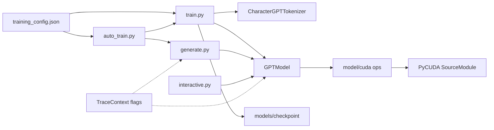

# NumPy + PyCUDA GPT Training Stack

## Decisions locked

- **Backend:** NumPy host + PyCUDA device kernels from day one (no PyTorch, no NumPy-only throwaway path).
- **Tracing:** Quiet by default; deep dumps only with `--verbose`, `--trace-logits`, `--trace-tokens`, `--trace-neurons`, `--trace-vectorization`.
- **Config source of truth:** [setup/training_config.json](setup/training_config.json) via [TrainingSetup.load_configuration](setup/training_setup.py).

## Architecture



## Module layout (new)

```
tokenizer/tokenizer.py      # CharacterGPTTokenizer
model/config.py             # GPTConfig from config['model']
model/weights.py            # Allocate float32 weights via WeightInitializer + scales
model/trace.py              # TraceContext + dump helpers (gated)
model/cuda/env.py           # CUDA PATH / add_dll_directory bootstrap (from 2_test_workspace)
model/cuda/kernels.py       # SourceModule: gemm, softmax, layernorm, gelu, add
model/cuda/ops.py           # Host API: matmul, softmax, layernorm over gpuarray
model/layers.py             # Attention, MLP, Block (call ops; optional TraceContext)
model/gpt.py                # GPTModel forward/backward, generate_step
training/dataset.py         # Sliding-window batches from corpus token ids
training/optimizer.py       # AdamW on NumPy param buffers (sync from GPU as needed)
training/loss.py            # Cross-entropy (+ optional logit dump)
training/checkpoint.py      # Save/load weights + tokenizer vocab + config → models/
training/probe.py           # Post-save sanity: reload, one forward, loss finite
train.py / auto_train.py / generate.py / interactive.py
```

Keep [setup/](setup/) config-only (no PyCUDA imports).

## Core behaviors

### Tokenizer

- Char-level vocab from corpus: same rule as setup — `sorted(set(''.join(corpus)))` (or join-with-space equivalent; **assert** `len(vocab) == config['model']['vocab_size']` or overwrite + warn).
- API: `encode`, `decode`, `encode_batch`, `id_to_token`, `token_to_id`; specials only if needed (`\n` as char).
- Trace helper: print `char → id → char` round-trips when `--trace-tokens`.

### Model + weight init

- Build params matching `estimate_vram_footprint` layout: token/pos emb, per-layer QKV/out/MLP/LN, final LN, lm_head.
- Init with [WeightInitializer](setup/weight_init.py) using scales from `config['weight_initialization']` (or regenerate via `get_init_scales_for_config`).
- Store params as NumPy `float32`; upload to `pycuda.gpuarray` for forward ops; download grads for AdamW v1 (simple, VRAM-safe on 4GB).

### PyCUDA kernels (v1)

Port env bootstrap from [setup/2_test_workspace.py](setup/2_test_workspace.py) (CUDA 10.1 bin, MSVC142 ccbin, `_NVCC_OPTIONS`).
Ship JIT kernels for:

- `gemm` (row-major float32 matmul)
- `softmax_rows`
- `layernorm`
- `gelu` (or relu if simpler for Kepler)
- `ewise_add` / scale

NumPy fallback path only as **assert/debug** when `--cpu-check` compares one op — not a second training backend.

### Training loop (`train.py`)

```text
python train.py --config setup/training_config.json [--epochs N] [--checkpoint models/run1]
                [--verbose] [--trace-logits] [--trace-tokens] [--trace-neurons] [--trace-vectorization]
```

- Load config → tokenizer → model init → AdamW from `hyperparameters`.
- Batches: windows of `max_len`, `batch_size` from config.
- Log each step: loss, lr (warmup), tokens/sec; write to `logs/training.log`.
- Checkpoint every epoch + final; run `probe` after each save.
- Trace only on selected steps (e.g. step 0 and `--trace-every N`) to avoid freezing the terminal.

### `auto_train.py`

Orchestrates: train to checkpoint → immediate `generate` smoke sample → print sample + probe summary. One command for "config → trained weights → text".

### `generate.py` / `interactive.py`

- Load checkpoint + tokenizer; greedy / temperature sampling.
- Default: print prompt, ids, decoded text.
- With flags: top-k logits table, chosen token id↔char, optional last-layer neuron summary / activation norms (not full matrices unless `--trace-vectorization`).

## Trace design

`TraceContext` holds booleans from CLI. Dump format is compact tables, not raw tensors, unless `--trace-vectorization`:

- `--trace-tokens`: `token | id | decode(id)`
- `--trace-logits`: top-10 logits + softmax probs before sampling / loss
- `--trace-neurons`: per-layer activation mean/std/norm + optional first/last-N dims
- `--trace-vectorization`: shape + stride notes for key GEMMs (M,K,N) to verify kernel launches
- `--verbose`: enables tokens + logits top-k on traced steps

## CLI entry contract

| Script           | Role                                |
| ---------------- | ----------------------------------- |
| `train.py`        | Train only from config              |
| `auto_train.py`   | Train + generate smoke + probe      |
| `generate.py`      | Checkpoint → sample text            |
| `interactive.py`   | REPL generate with optional traces  |

All share argparse helpers in a small `cli_common.py` (config path, checkpoint path, trace flags, seed).

## Out of scope for this pass

- Full GPU-resident AdamW / fused backward kernels (CPU AdamW on downloaded grads is OK for Medium ~600k params).
- Multi-GPU, mixed precision, BPE tokenizers.

## Verification

1. `python setup/2_test_workspace.py` still green.
2. Tiny smoke: override or use tiny preset → `auto_train.py` completes 1 epoch, probe OK, generates non-empty string.
3. With `--trace-tokens --trace-logits` on generate: show id↔char and top-k without dumping full `[T,V]` unless vectorization flag set.
4. Medium + `tiny_stories` from existing config runs at least 1 epoch without OOM.

## Implementation notes / known pitfalls to avoid

- **Reuse the existing CUDA bootstrap, don't reinvent it.** `model/cuda/env.py` must replicate the `_NVCC_OPTIONS` / `add_dll_directory` / PATH ordering already proven in [setup/2_test_workspace.py](setup/2_test_workspace.py) (explicit `-ccbin` to the MSVC 14.29 `cl.exe`, UCRT/UM/shared includes). Do not compile with only `-arch=sm_35` and no `ccbin` — that path was never validated in this workspace and Windows NVCC will fail to find a host compiler.
- **Shared-memory reduction kernels need zero-init before accumulation.** Any kernel using `__shared__ float s_mean/s_var/s_sum` with `atomicAdd` must have thread 0 initialize it to `0.0f` and `__syncthreads()` before the accumulating loop — otherwise the first read is undefined.
- **Float max-reduction via `atomicMax((int*)&s_max, __float_as_int(x))` is only valid for non-negative values.** Logits are frequently negative, so the softmax kernel's max-finding must use a correct signed-float atomic max pattern (e.g. bias by a large constant, or do a straightforward serial/warp-shuffle reduction) instead of the naive int-cast trick.
- Keep raw kernel source in `model/cuda/kernels.py` and grid/block-sizing + memory transfer logic in `model/cuda/ops.py` — don't collapse both into one file.
