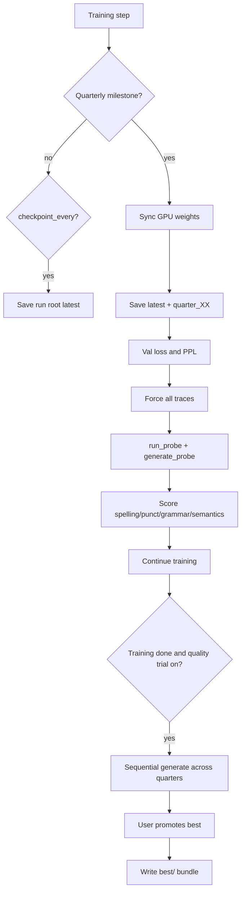

# Quarterly Checkpoints, Quality Trial & Resume (v0.1.0)

## Versioning

- Introduce project version **`0.1.0`** (all prior work is pre-0.1.0 / `0.0.x`–`0.9.9`).
- Add [`VERSION`](VERSION) (`0.1.0`) and a small `version.py` with `__version__`.
- Print version at start of [`train.py`](train.py) and [`auto_train.py`](auto_train.py); stamp `config.json` / `state.json` with `"version": "0.1.0"`.

## Current gaps (what we build on)

- Quarterly **generate probes** already exist via [`GENERATE_PROBE_FRACTIONS`](training/probe.py) `(0.25, 0.50, 0.75, 1.0)` in [`train.py`](train.py), but they only overwrite one run dir.
- Traces use a separate `--trace-every` cadence; generate probes do **not** attach a tracer.
- No val split, no per-quarter weight files, no `best/`, no quality trial.
- Resume picker only lists top-level dirs with `config.json` ([`cli_common.list_checkpoints`](cli_common.py)).

## Checkpoint layout (per run)

```text
output/checkpoints/<run>/
  weights.npz | config.json | state.json | vocab.json | corpus.json   # latest ("normal")
  metrics.json                                                         # latest train/val/ppl + quality
  quarter_25/   # step = 25% of total_steps
  quarter_50/
  quarter_75/
  quarter_100/
  best/         # only after user promotes via quality trial / --set-best
```

Each `quarter_*` and `best/` is a **full** checkpoint bundle (same files as today via [`save_checkpoint`](training/checkpoint.py)), so any of them is independently resumable.

At every quarterly step the loop will:

1. Sync GPU → host
2. Save **latest** (run root) **and** the matching `quarter_XX/`
3. Eval **val loss / val PPL** on the holdout
4. Force **all traces** + `run_probe` + `run_generate_probe` (with tracer)
5. Run optional **quality scoring** on the generated text and append to `metrics.json` / logs

Periodic `--checkpoint-every` keeps updating **latest only** (no new quarter dirs).

## 1. Generate / probe at quarterly steps

Keep milestone math in [`training/probe.py`](training/probe.py); fold the duplicate save+probe in the training loop into one **quarterly handler** so a milestone does not double-save when it also lands on `checkpoint_every`.

Wire the same path from [`auto_train.py`](auto_train.py) (it already calls `train.train`). Add missing probe CLI parity to `auto_train` (`--no-generate-probe`, `--generate-probe-prompt`, `--generate-probe-tokens`, `--resume`).

## 2. Full traces at quarterly steps

In the quarterly handler, temporarily force a full tracer (`trace_logits`, `trace_tokens`, `trace_neurons`, `trace_vectorization`, `trace_every=1`) for:

- the training forward on that step (already in-loop), and
- `run_generate_probe(..., tracer=..., tokenizer=...)` so generate dumps logits/tokens (and neurons/vectorization via `forward`)

Non-quarter steps keep today’s `--trace-*` / `--trace-every` behavior.

## 3. Val holdout (10%) + metrics

In [`train.py`](train.py) setup (fresh and resume):

- Split corpus sentences **once** with fixed seed: **90% train / 10% val** (store both in config / `corpus.json` shape so resume is stable: e.g. `dataset.corpus` + `dataset.val_corpus`, or a `val_corpus.json`).
- Build a second [`WindowedDataset`](training/dataset.py) for val (or a small eval helper that runs N fixed val batches).

At each quarterly checkpoint, compute mean CE **val_loss** and **val_ppl = exp(min(val_loss, 50))**; log `[train]`-parseable keys (`val_loss`, `val_ppl`, `ppl` from recent train loss) for the existing plotters.

## 4. Generation-quality trial (manual best; configurable)

**No automatic `best/` updates.** Best is promoted only by the user after a sequential trial.

Add a quality module (e.g. [`training/quality.py`](training/quality.py)) that scores generated text on four heuristic indicators (0–1, higher better), designed as **relative improvement signals**, not a judge model:

| Axis | Signal (lightweight, no external deps) |
|------|----------------------------------------|
| Spelling | Word-charset / repeated-char garbage rate; optional wordlist if present under `data/` |
| Punctuation | Sentence terminators, spacing around punctuation, quote/paren balance |
| Grammar | Capitalization after terminators, extreme repetition, broken spacing |
| Semantics | Prompt-token overlap in continuation, unique-token ratio, non-gibberish entropy |

Aggregate = configurable weighted mean (CLI/config weights; defaults equal).

**Sequential inter-checkpoint trial** (`train.py --compare-quarters --checkpoint <run>` and menu option under `--menu` / resume flow):

1. Discover `quarter_25`…`quarter_100` under the run
2. For each, load → generate with the **same** prompt / seed / sampling flags
3. Score all four axes + print sample + **deltas vs previous quarter** (“improving / regressing”)
4. Prompt: promote one as `best/` (copy full bundle + write `best/best_meta.json` with source quarter, step, scores)

Flags (shared via `cli_common`):

- `--quality-trial` / `--no-quality-trial` — after training (and optionally after each quarter log-only), run or skip the interactive promote step (default: off for `--no-prompt`, on when interactive)
- `--quality-prompt`, weights overrides if needed
- `--set-best quarter_50` — non-interactive promote

## 5. Resume from latest, best, or any quarter

Extend [`list_checkpoints`](cli_common.py) / resume + generate menus to list:

- `<run>` (latest / normal)
- `<run>/best` (if present)
- `<run>/quarter_25` … `quarter_100`

Show step + short metrics from `state.json` / `metrics.json` when available.

Resume behavior unchanged otherwise: load that dir’s weights + `state.step`, skip past milestones, train **additional** steps; continue writing into the **parent run root** as latest, and write new quarters relative to the **new** `total_steps` only for milestones still pending (document clearly in logs).

Add `--resume` to [`auto_train.py`](auto_train.py).



## Key files to change

- [`training/checkpoint.py`](training/checkpoint.py) — `save_checkpoint` to quarter/best paths; optional `metrics.json`; version stamp
- [`training/probe.py`](training/probe.py) — tracer on generate probe; shared quarterly orchestration helpers
- **New** [`training/quality.py`](training/quality.py) — scorers + compare/promote CLI helpers
- [`train.py`](train.py) — val split, quarterly handler, compare-quarters / set-best modes
- [`auto_train.py`](auto_train.py) — `--resume`, probe/quality flags, version banner
- [`cli_common.py`](cli_common.py) — nested checkpoint listing + quality/resume args
- [`paths.py`](paths.py) — helpers for `quarter_XX` / `best` names
- **New** [`VERSION`](VERSION) + [`version.py`](version.py)

## Defaults locked in

- Quarters: 25/50/75/100% of `total_steps`
- Val: **10% sentence holdout**, seeded
- Best: **manual only**, after configurable sequential quality trial
- Traces at quarters: **all four** forced on
- Version: **0.1.0**
