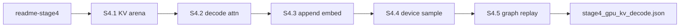

# Stage 4 Plan Locked: Capture-Compatible GPU-Resident KV Decode

**Status: SHIPPED (2026-07-31).** Arena capacity from `GPTConfig.max_len` (not hardcoded 128). Same path for `tiny_stories` (T=128) and BiggerTest (T=256). Baseline: `output/baselines/stage4_gpu_kv_decode.json` (`decode_capture.mode = "graph"`). Honest limit: graph covers `append → decode → argmax` only; full transformer decode stays eager on the PyCUDA default stream.



Discipline every milestone: **Change → Parity → Bench → Baseline → README**.

---

## 1. README Update (`readme-stage4`)

In [`README.md`](README.md), replace the post–Stage 3 “Not yet” tree (including AMP / FP16 GEMM) with:

```text
Not yet (Stage 4 — CUDA Graph Generation)
├── capture-compatible GPU-resident KV decode (removes host attention syncs)
├── static memory arenas for graph capture (fixed max sequence/batch sizes)
└── device-side sampling (argmax / top-k) to prevent host fallbacks
```

Retarget the accompanying “Next” sentence to **Stage 4 stabilization**, not general post–Stage 3 work. AMP remains out of scope (already noted in [`guide.md`](guide.md) pitfalls).

---

## 2. Execution roadmap

| Milestone | Focus | Key deliverable |
|-----------|--------|-----------------|
| **S4.1** Static device KV arena | Memory layout | Pre-allocated `k_d` / `v_d` (`[B*H, max_len, hd]`) filled on GPU during prefill. Extend [`tests/parity/test_kv_cache.py`](tests/parity/test_kv_cache.py). |
| **S4.2** Device-resident decode attention | CUDA kernels | `causal_mha_decode_fp32` in [`model/cuda/kernels.py`](model/cuda/kernels.py) + ops. No `to_host` on decode attention hot path. |
| **S4.3** Device cache append and embedding | Ingestion | Direct device row writes at index `T`; single-token `embedding_lookup_tokens` on GPU. |
| **S4.4** Device-side sampling | Graph safety | Device `argmax` and fixed-k top-k to avoid CPU fallback during graph replay. Top-p + RNG stay host/eager. |
| **S4.5** CUDA Graph capture and replay | Acceleration | Stream unification; decode-step capture/replay via [`generate.py`](generate.py) `--cuda-graph`. |

### Sync breakers today (must clear by S4.5)

| Hot-path step | File | Break |
|---------------|------|--------|
| `_extract_kv_state` | [`model/gpt.py`](model/gpt.py) | `to_host` of K/V after prefill |
| `_decode_kv` | [`model/gpt.py`](model/gpt.py) | host embed, host RoPE/attn, `to_host` logits |
| `_sample_next_id` | [`model/gpt.py`](model/gpt.py) | host softmax / top-k / top-p / RNG |
| `try_capture_decode` | [`model/cuda/graph.py`](model/cuda/graph.py) | stream mismatch; no replay; always fallback |

### Milestone notes

**S4.1** — Host length `T` may remain a Python int for launch geometry; cache contents stay on device. Legacy host KV kept only as bring-up / parity reference.

**S4.2** — Q `[BH,1,hd]` vs K/V `[BH,max_len,hd]` with valid length `T`. RoPE via existing `rope_apply_inplace` (`pos_offset=T`). Greedy KV vs no-KV parity for LN+learned and rmsnorm+RoPE.

**S4.3** — Sliding-window re-prefill at `T == max_len` stays eager (outside graph). Graph covers steady-state decode with `T < max_len`.

**S4.4** — Device argmax required for graph path; fixed-k top-k next. Interactive top-p remains host until a later follow-on.

**S4.5** — Warm ScratchPool / LifetimeAllocator / KV arena / decode temps before capture. Prefer max_len-sized buffers + mask so one graph covers growing `T`. If CUDA 10/Kepler forces recapture-per-T, document and keep eager GPU decode (still a win vs host attention).

---

## 3. Verification and baseline target

| Gate | Requirement |
|------|-------------|
| Correctness | Full parity suite OK; greedy KV matches no-KV; rmsnorm+RoPE decode shapes |
| Bench | S4.5 generate vs BiggerTest **T=256** in [`output/baselines/stage32_kv_generate.json`](output/baselines/stage32_kv_generate.json) |
| Artifact | Freeze [`output/baselines/stage4_gpu_kv_decode.json`](output/baselines/stage4_gpu_kv_decode.json) with **`decode_capture.mode = "graph"`** |
| Docs | README Stage 4 “Exists” grows as milestones ship; `guide.md` / `py_calls.md` for `--cuda-graph` |

**Out of scope:** native FP16 GEMM / AMP training, ScratchPool redesign, BPE as BiggerTest default.
